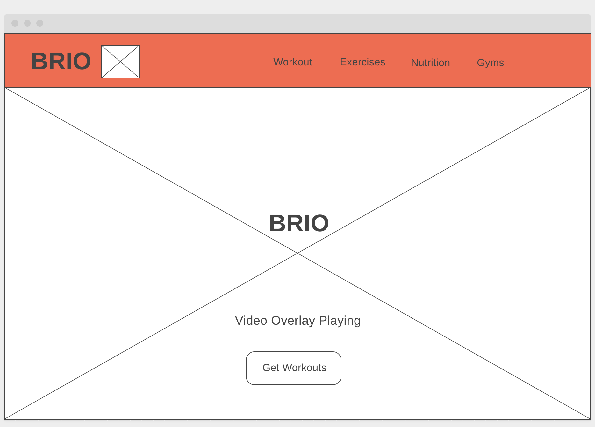
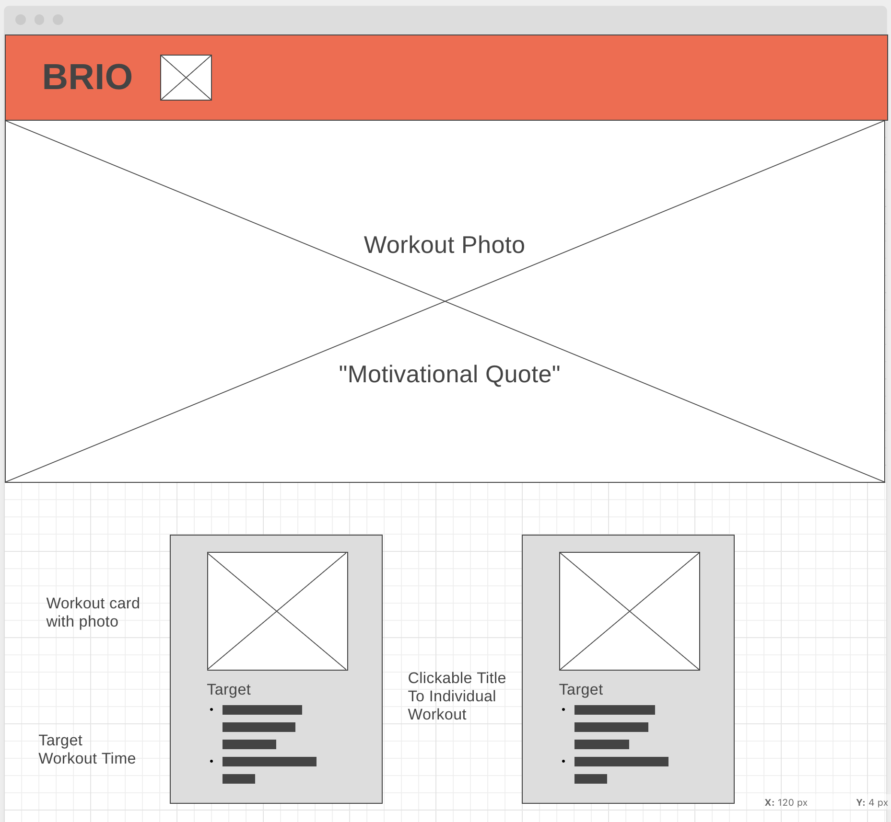
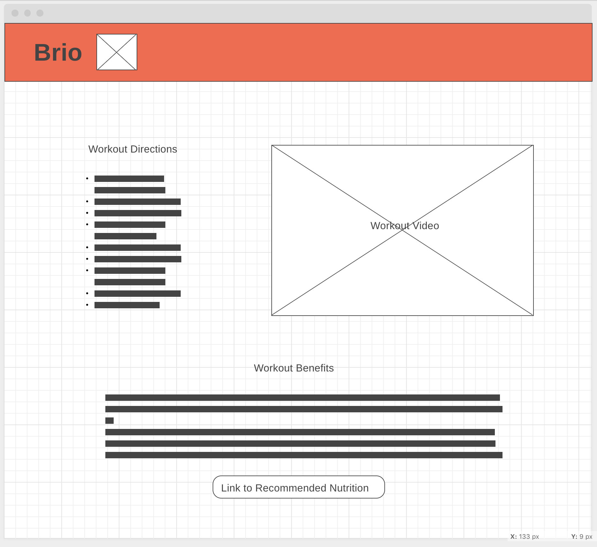
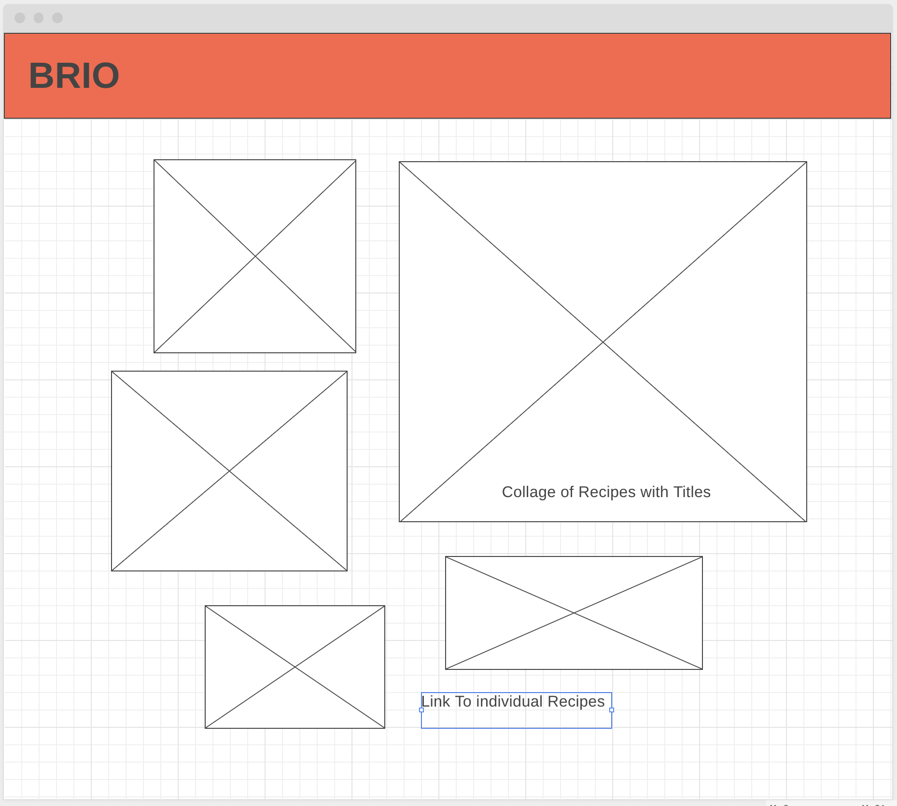
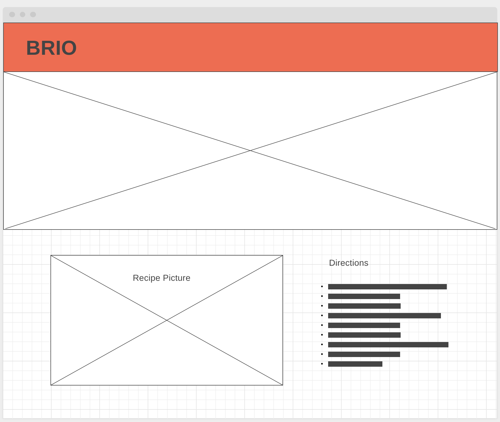
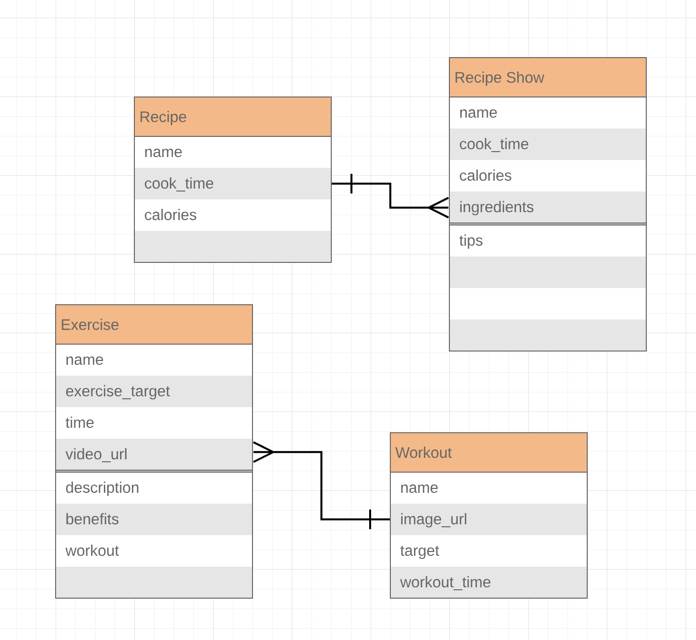

# Brio

General Assembly WDI 20 - Project 4

- Project: https://brio-fitness.herokuapp.com/workouts
- Trello Board: https://trello.com/b/DgWAeWVl/brio
- Git Hub: https://github.com/JessicaBPerez/Brio.git

## Overview

The goal of this project was to utilize my knowledge of React, Python, Django, and libraries to build and style an interactive web application that permanently stores data in a database. We then render, create, edit, or delete new data to make our app interactive. My app is called "Brio." Brio is a work-out web application that displays lists of workouts, and exercises. Brio also has healthy recipes along with the ingredients and cooking instructions to those recipes. Users have the option to add, edit or delete a workout card on the main page, and exercises that correspond to the workouts. Users can also add, edit, or delete their own recipes as well as personalize their ingredients. Users also have access to a real-time weather tracker that will display the current weather in addtion to weather for the next three days using an OpenWeather API call. The weather also automatically updates every three hours. Users also have access to America's most popular top ten songs via a Napster API call.

## Wireframes

#### Workout Page

#### Individual Workout Page

#### Recipe Page

#### Individual Recipe Page

## ERD

## Technologies Used

1. Languages:

- CSS
- JavaScript

2. Libraries:

- Bootstrap
- React

3. Frameworks/ Technologies:

- Django
- Django Rest Framework
- Python
- Pipenv

## Future Developments/Improvements for Version 2

- Spotify authentication so users can listen to their own playlists.
- Make site more interactive.
- Workout recommendations based on workout video views.